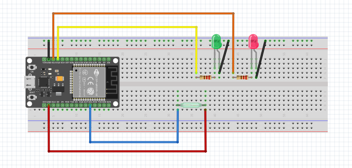

# coop-door-monitor
ESP32 project to monitor door status and notify via Telegram

I use a Coop-Controls automatic door opener, but I do not have visibility to ensure door actually shuts or when it shuts. So this project will give me some insite to when it opens and closes as well as making sure it does shut at night.

The project uses the following libraries:

1. UniversalTelegramBot
2. WiFiManager
3. Arduino Json

Rename sample_secrets.h to secrets.h and enter in your Telegram details. To get the Telegram details follow this tutorial from Telegram.
https://core.telegram.org/bots/tutorial
or
https://randomnerdtutorials.com/telegram-esp32-motion-detection-arduino/

